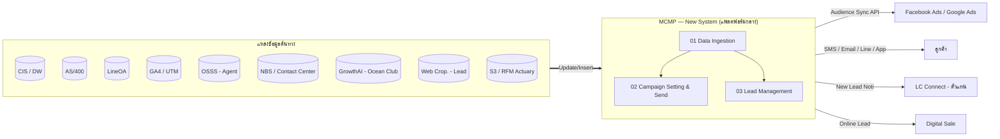
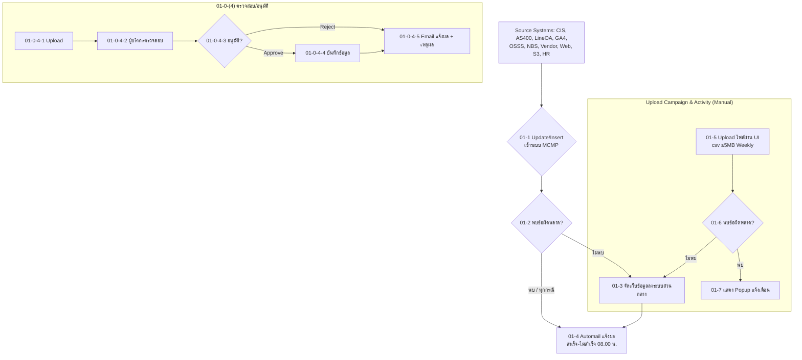
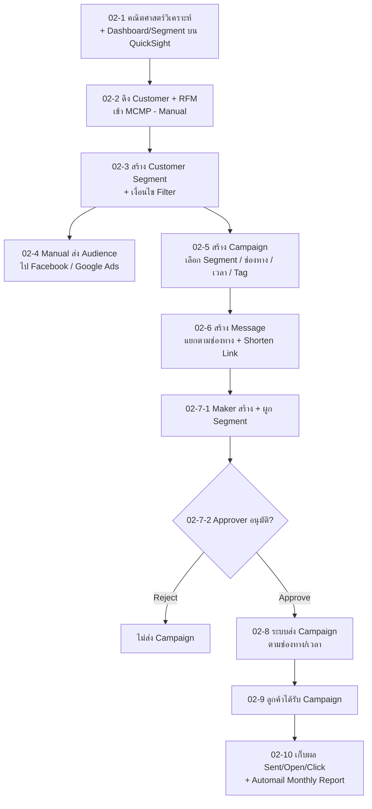
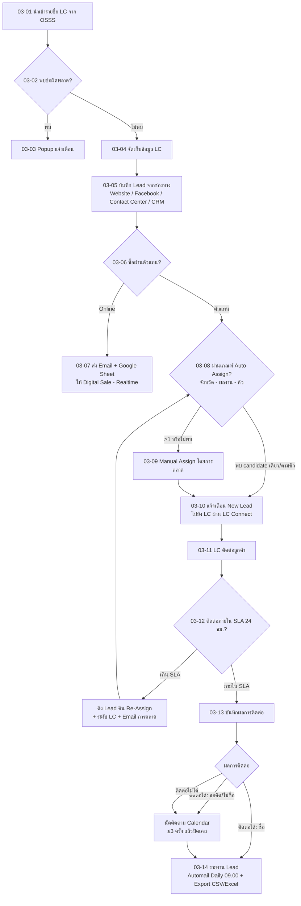

# สรุป BRD & Workflow — Marketing Campaign Management Platform (MCMP)

> **Project Code:** 20240278 | **Document:** Business Requirement Document & Workflow **v0.1** (07/05/2569)
> **Owner:** ฝ่ายการตลาด — บมจ. ไทยสมุทรประกันชีวิต (Ocean Life Insurance)
> **ผู้จัดทำ:** ชลลัดดา เจียรธีรวิทย์ | **BA:** ภิรญา (piraya.ph)

---

## 1. ภาพรวมโครงการ (Project Overview)

ระบบ **MCMP (Marketing Campaign Management Platform / "New System")** คือแพลตฟอร์มกลางของฝ่ายการตลาด เพื่อ:

1. **รวบรวมข้อมูลลูกค้า** จากหลายแหล่งต้นทางให้เป็น Single View
2. **สร้าง Customer Segment** และทำการตลาดแบบเจาะกลุ่ม (รวม RFM / CLV Model)
3. **สร้างและส่ง Campaign** หลายช่องทาง (SMS / Email / Line Ocean Connect / Ocean Club App)
4. **เชื่อมต่อโฆษณาออนไลน์** (Facebook Ads / Google Ads) แบบ Customer Match / Lookalike
5. **บริหารจัดการ Lead** ตั้งแต่รับเข้า → แจกตัวแทน (LC) → ติดตามผล → รายงาน

### โครงสร้างเอกสาร (42 หน้า)
| ส่วน | เนื้อหา |
|------|---------|
| หน้า 1–4 | Sign-off, Distribution List, Version History, วัตถุประสงค์ BRD |
| หน้า 5–20 | **BA Comment** — 105 ประเด็น (Close 100, Recheck 5) |
| หน้า 22–27 | **Functional Requirement** — Process 01, 02, 03 |
| หน้า 28–30 | **Field สำหรับ Filter / Segment** (Customer, Policy, Ocean Connect, Ocean Club, RFM) |
| หน้า 31 | **Static-Rule Campaign & Automated Audience Sync** (สถาปัตยกรรม Quick Win) |
| หน้า 32–34 | รายการ Campaign + Template/ตัวอย่าง + Data Dictionary (BZB) |
| หน้า 35–40 | Technical Info — SQL (Athena/Glue), FB/Google Ads API, Master tables |

---

## 2. กระบวนการหลัก 3 กระบวนการ (Core Processes)

### Process 01 — กระบวนการดึงข้อมูลจากแหล่งต้นทาง (Data Ingestion)
ดึง/อัปเดตข้อมูลเข้าระบบส่วนกลาง (Update/Insert) แบบ Daily (23.00 น.) และ Realtime

| แหล่งข้อมูล | ระบบต้นทาง | ความถี่ |
|---|---|---|
| Customer | CIS / OLI Database | Daily |
| Policy (กรมธรรม์) | AS/400 | Daily |
| Line Ocean Connect | LineOA / Marketing Backoffice | Daily |
| Campaign & Activity | Upload UI / Path (Manual + อนุมัติ) | Weekly |
| Contact Center / FB Inbox | NBS (Case Management) | Realtime |
| Ocean Club App | Vendor (GrowthAI) วางไฟล์ใน Path | Daily |
| UTM Behavior | Google Analytics 4 | ตามกำหนด |
| ตัวแทน (Agent) | OSSS | Daily / Near-realtime |
| RFM Model | Data Platform (S3) / Actuary | Manual |
| Lead | Web Crop. (Code Plan/API) | Realtime |
| Staff | HR Upload | Manual |

- มีการตรวจ error → ถ้าสำเร็จเก็บลงระบบกลาง, ทุกกรณีส่ง **Automail แจ้งผล (08.00 น.)**
- กรณีไม่พบไฟล์ใน Path → Automail แจ้งฝ่ายที่เกี่ยวข้อง (09.00 น.)
- **Sub-process 01-0-(4):** Upload Campaign/Activity → ผู้บริหารตรวจสอบ → อนุมัติ/ไม่อนุมัติ → บันทึก + แจ้ง Email

### Process 02 — Setting และส่ง Campaign
1. **02-1** คณิตศาสตร์วิเคราะห์ + ทำ Dashboard/Segment บน **QuickSight**
2. **02-2** ดึง Customer + RFM จาก Dashboard เข้า MCMP (Manual)
3. **02-3** สร้าง **Customer Segment** + เงื่อนไข Filter (Create/Edit/Clone/Active-Inactive, Export Raw Data, exclude Consent No & Do-not-contact)
4. **02-4** Manual ส่ง Audience ไป **Facebook Ads / Google Ads** (Customer Match via API)
5. **02-5** สร้าง **Campaign** (เลือก Segment, ช่องทาง SMS/Email/Line/App, Message, ตั้งเวลาส่ง 3 แบบ, Tag, Retarget, แสดงผล Sent/Open/Click)
6. **02-6** สร้าง **Message** แยกตามช่องทาง (ตัวแปรเฉพาะบุคคล, Shorten Link ด้วย Infobip, Preview)
7. **02-7** **กระบวนการอนุมัติ (Maker/Checker)** → 02-7-1 สร้าง+ผูก Segment, 02-7-2 Approver อนุมัติ/ไม่อนุมัติ
8. **02-8** ระบบส่ง Campaign ตามเวลา (ยึดเบอร์/อีเมลจาก CIS เป็นหลัก)
9. **02-9** ลูกค้าได้รับ Campaign
10. **02-10** เก็บผล + Action (Open/Click/Unique) → **Automail Monthly Summary** (วันที่ 1 ของเดือนถัดไป 13.00 น.)

### Process 03 — กระบวนการบริหารจัดการ Lead (Lead Management)
1. **03-01** นำเข้ารายชื่อ **LC จาก OSSS** (เลือกได้ ≤10 รายชื่อ/จังหวัด, ≤10 จังหวัด/ครั้ง, อัปเดตอัตโนมัติ)
2. **03-02/03/04** ตรวจ error → Popup / จัดเก็บ
3. **03-05** บันทึก **Lead** จากช่องทาง: Website (auto), Facebook (manual), Contact Center (manual, ต้องผ่าน VPN/VDI กรณี WFH), CRM Event (Import Excel/CSV) — มีตรวจ Lead ซ้ำ
4. **03-06** ลูกค้าซื้อผ่านช่องทางใด → **Online** ไป 03-07 (ส่งให้ Digital Sale ทาง Google Sheet + Email) / **ตัวแทน** ไปเข้าเงื่อนไข Assign
5. **03-07** ส่ง Email แจ้ง Digital Sale (Realtime)
6. **03-08** เกณฑ์ **Auto Assign** (Near-realtime): จังหวัดตรงกัน → ผลงานทุกงวด → ผลงานบางงวด → หมุนเวียนตามคิว (Round Robin); ทำ **Lead Scoring** (มีช่วงเวลาติดต่อ = Hot / ไม่มี = Warm)
7. **03-09** **Manual Assign** กรณีระบบเลือกไม่ได้
8. **03-10** แจ้งเตือน New Lead ไปยัง LC ผ่าน **LC Connect**
9. **03-11** LC ติดต่อลูกค้า (เมนู My Lead, กดโทรออก, ดู Lead Detail)
10. **03-12** **SLA 24 ชม.** (Hot นับจากเวลานัด / Warm นับจากเวลา Assign ในช่วง 9–18 น.) → ไม่ติดต่อ = ดึง Lead คืน Re-assign + ระงับ LC (5/10/15/20 วัน หรือถาวร) + Email แจ้งการตลาด (09.00 น.)
11. **03-13** **บันทึกผลการติดต่อ** (Contact Result): ติดต่อได้ [ขอตัดสินใจก่อน/ไม่ซื้อ/ซื้อ-เช็คสถานะใน UW], ติดต่อไม่ได้ — ติดต่อสูงสุด 3 ครั้ง → ปิดเคส; Lead ปิดการขายไม่ได้เก็บ 3 เดือนแล้วลบอัตโนมัติ
12. **03-14** **รายงาน** — Automail Daily Report (09.00 น.), Export CSV/Excel ทำ Dashboard

---

## 3. Workflow Diagrams

### 3.1 ภาพรวมระบบ (System Context)

### 3.2 Process 01 — Data Ingestion

### 3.3 Process 02 — Campaign Setting & Send

### 3.4 Process 03 — Lead Management

---

## 4. ประเด็นสำคัญ / Business Rules ที่ควรรู้

- **Single Source of Truth:** กรณีพบข้อมูลลูกค้าหลายแหล่ง ให้ยึด **เบอร์โทร/อีเมลจาก CIS** เป็นหลัก
- **Consent & Do-not-contact:** ต้อง exclude ลูกค้า Consent = No และเบอร์ที่อยู่ใน Do-not-contact list (กรองตอน Setup Segment)
- **Maker/Checker:** ทั้งการนำเข้า Campaign/Activity (01-0-4) และการส่ง Campaign (02-7) ต้องผ่านการอนุมัติ
- **SLA Lead:** ติดต่อภายใน 24 ชม. — ไม่ติดต่อ = ดึงคืน + ระงับการรับ Lead (เลือก 5/10/15/20 วัน หรือถาวร)
- **Lead Scoring:** มีช่วงเวลาให้ติดต่อ = Hot Lead / ไม่มี = Warm Lead
- **Data Retention:** Lead ปิดการขายไม่ได้ เก็บ 3 เดือน แล้วลบอัตโนมัติ
- **Segmentation Model:** รองรับ RFM Group (11 กลุ่ม), CLV Group (6 ระดับ), Customer Segment (6 กลุ่ม), Age Group
- **Quick Win (หน้า 31):** Static-Rule Campaign — Actuary → S3 → QuickSight → ESB API → FB/Google Ads (เน้น campaign เงื่อนไข static)

---

## 5. ระบบ/เทคโนโลยีที่เกี่ยวข้อง (Systems Involved)

| ประเภท | ระบบ |
|---|---|
| ต้นทางข้อมูล | CIS, AS/400, LineOA, OSSS, NBS, GA4, HR |
| Data Platform | DW, S3, AWS Glue/Athena (gluedb_prod_lakecurated), QuickSight |
| Vendor | GrowthAI (Ocean Club App), Infobip (SMS/Shortlink) |
| ปลายทาง | Facebook Ads, Google Ads (ผ่าน ESB/API), LC Connect, Digital Sale |
| ช่องทางส่ง | SMS, Email, Line Ocean Connect, Ocean Club App |

---
*สรุปจากเอกสาร BRD_V0.1 (42 หน้า) — สำหรับใช้เริ่มต้นโครงการ*
